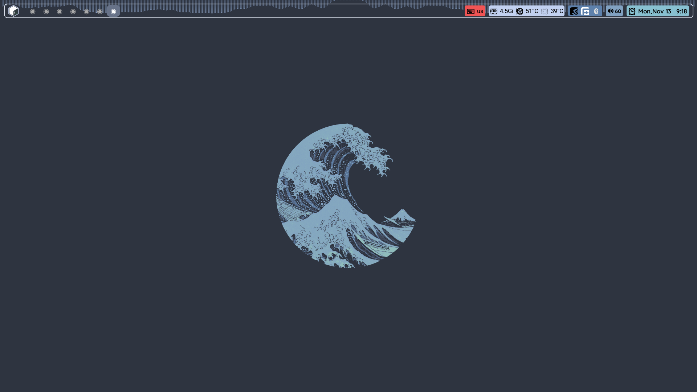

    <h1>My Files</h1>

---

---

    <h1>Welcome to my dotfiles</h1>

---
<image align="right" width="450px" src="./assets/neofetch.png"/>

**My system setup**:

- **OS**                   : Debian 
- **WM**                   : Awesome Stable
- **Terminal**             : Alacritty
- **Compositor**           : Picom
- **Application Launcher** : Rofi
- **File Manager**         : Thunar
- **Icons**                : Tela grey
- **Cursor**               : Oreo Spark Lite Cursors
- **Font**                 : Quicksand Medium
- **Editor**               : Vim && VS Code
